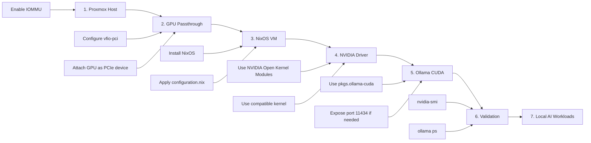

# Proxmox NixOS Ollama GPU VM

NixOS VM template with Ollama, NVIDIA GPU support, and Proxmox PCIe passthrough, designed for running local AI models on an RTX 5060 Ti.

## Overview

This repository contains a reusable NixOS configuration for a GPU-enabled virtual machine running Ollama.

The main goal of this project is to keep a simple, maintainable, versioned, and reproducible NixOS VM template that can be reused whenever a new GPU-enabled VM needs to be created.

By storing the setup in Git, the configuration becomes easier to review, update, maintain, and replicate across future virtual machines without repeating the entire manual setup process.

The reference setup was built on Proxmox VE using PCIe GPU passthrough with an NVIDIA RTX 5060 Ti. It is intended for local AI workloads, homelab experiments, and LLM inference with GPU acceleration.

```
Proxmox VE Host
└── NixOS VM
    ├── NVIDIA GPU via PCIe passthrough
    ├── NVIDIA Open Kernel Modules
    ├── Ollama with CUDA support
    └── Ollama API exposed on port 11434
```

## Reference Environment

This template was tested with the following environment:

| Component          | Version / Value     |
| ------------------ | ------------------- |
| Hypervisor         | Proxmox VE 9.2.3    |
| Host Kernel        | 7.0.6-2-pve         |
| QEMU               | 11.0.0              |
| CPU Platform       | AMD with AMD-Vi     |
| GPU                | NVIDIA RTX 5060 Ti  |
| GPU Architecture   | Blackwell / GB206   |
| Guest OS           | NixOS 26.05 minimal |
| Guest Kernel       | Linux 6.12 LTS      |
| NVIDIA Driver      | 595.45.04           |
| NVIDIA Driver Mode | Open Kernel Module  |
| CUDA               | 13.2                |
| Ollama             | 0.30.5              |
| Ollama Package     | `pkgs.ollama-cuda`  |
| Ollama Port        | 11434               |

## Architecture and Setup Steps



## Setup Summary

The setup process followed these main steps:

1. Prepare the Proxmox host with IOMMU enabled.
2. Bind the NVIDIA GPU to `vfio-pci`.
3. Create a NixOS VM using OVMF/UEFI and q35.
4. Attach the NVIDIA GPU to the VM using PCIe passthrough.
5. Install NixOS and apply this repository configuration.
6. Enable NVIDIA Open Kernel Modules in the guest.
7. Use `pkgs.ollama-cuda` for GPU-accelerated Ollama.
8. Validate the setup with `nvidia-smi`, `systemctl status ollama`, and `ollama ps`.

## What This Repository Includes

* NixOS configuration for an Ollama VM
* NVIDIA GPU support inside the guest VM
* CUDA-enabled Ollama setup
* OpenSSH service configuration
* Firewall configuration for SSH and Ollama API
* Basic system tools for monitoring and validation

## What This Repository Does Not Include

This repository is not intended to be a complete Proxmox installation guide.

Host-level passthrough configuration can vary depending on:

* CPU platform: Intel or AMD
* Proxmox version
* GPU model
* IOMMU groups
* Kernel version
* VM machine type
* NVIDIA driver compatibility

Use this repository as a reference template and adjust it according to your own environment.

## Important Notes for RTX 50xx / Blackwell GPUs

This setup was tested with an RTX 5060 Ti from the Blackwell generation.

For this GPU generation, the following points were important:

* Use NVIDIA Open Kernel Modules in the NixOS guest.
* Use a compatible Linux kernel.
* Use `pkgs.ollama-cuda` instead of the default Ollama package.
* Ensure Ollama can access NVIDIA runtime libraries.
* Avoid unnecessary Proxmox PCI passthrough flags that may break QEMU with newer GPUs.

Older NVIDIA GPUs may not require the same adjustments.

## Quick Validation

After applying the NixOS configuration, validate the NVIDIA GPU:

```bash
nvidia-smi
```

Check the Ollama service:

```bash
systemctl status ollama
```

Test a small model:

```bash
ollama run llama3.2:1b
ollama ps
```

If GPU acceleration is working, `ollama ps` should show the model using the GPU instead of running only on CPU.

## Ollama API

The Ollama API is exposed on port `11434`.

Example:

```bash
curl http://YOUR_VM_IP:11434/api/tags
```

> Note: Exposing the Ollama API on `0.0.0.0` is useful for local networks, but it should be protected with firewall rules, VPN, or reverse proxy authentication in untrusted environments.

## Repository Structure

```text
.
├── configuration.nix
├── hardware-configuration.nix
├── .gitignore
└── README.md
```

## Usage Notes

This repository is intended as a reusable template.

Before applying it to a new VM, review and adjust:

* Disk layout in `hardware-configuration.nix`
* Network configuration
* Username
* SSH access method
* Firewall rules
* GPU driver package if using a different NVIDIA generation

For a fresh NixOS installation, generate the hardware configuration first:

```bash
sudo nixos-generate-config --root /mnt
```

Then compare the generated `hardware-configuration.nix` with the template in this repository.

## Security Notes

Before publishing or reusing this configuration, review all files and avoid exposing:

* Real IP addresses
* Private hostnames
* Usernames
* Passwords
* SSH keys
* Tokens
* Disk UUIDs
* MAC addresses
* VM IDs
* Internal domains
* Private infrastructure names

Use placeholders whenever possible.
